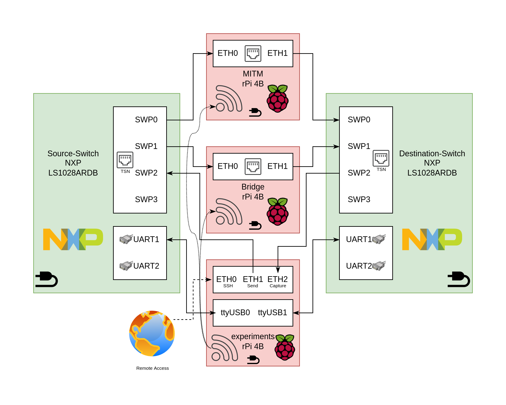

# tsn-hardware-testbed-802.1CB
This repository contains configuration files and scripts to perform Time-Sensitive Networking tests on a hardware test-bed.
It focuses on the IEEE 802.1CB specification but can easily be extended for different substandards.
It was made during research of a master thesis on the University of Delft. The full research document can be found in the TU Delft Repository or [here](thesis.pdf).

## Architecture Overview

## Hardware Requirements
While the hardware test-bed has been designed for the following hardware components, these exact models are not required. Especially the Raspberry Pi's and Ethernet dongles can be easily changed to similar components.  
- 2x NXP Layerscape LS1028A Reference Design Board  
- 3x Raspberry Pi 4  
- 4x TP-Link UE300  
- Network/Serial cables and power supplies

## Repository Structure
The `network-configuration` folder contain the `/etc/network/interfaces` files for each specific device.
This configures the network configuration to provide communication within the network by enabling interfaces and creating bridges.  

The `wifi-configuration` folder contains documentation and the required files for setting up the wifi hotspot on the source device.
This is used for remote access to this device, and then managing al the other devices through this source device.
While this is an optional feature, it might make your life easier when working from home or sharing it with other researchers.  

The `scapy` folder contains scripts that are used to generate, modify, and receive network packets. Several Proof of Concept attacks on the IEEE 802.1CB specification are implemented and can be used during a MITM attack.
